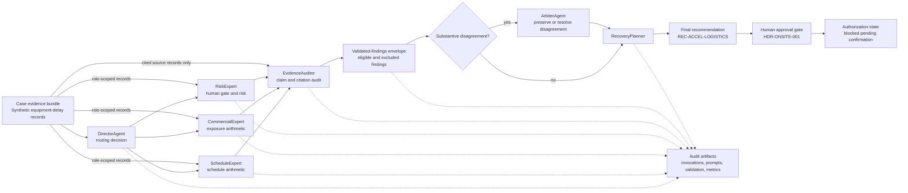

# Architecture Diagram Specification

## Purpose

Show how the dynamic Qwen expert council turns source evidence into a governed
project recovery recommendation without treating the model as the only control
point.

## Diagram Elements

- Case evidence bundle
- DirectorAgent
- selected experts:
  - ScheduleExpert
  - CommercialExpert
  - RiskExpert
- EvidenceAuditor
- optional ArbiterAgent
- validated-findings envelope
- RecoveryPlanner
- human approval gate
- final recommendation
- audit artifacts and evaluation report

## Visual Notes

- Use one horizontal flow from evidence to recommendation.
- Show role-scoped evidence going into each specialist.
- Show EvidenceAuditor checking specialist claims and citations.
- Show ArbiterAgent as conditional, not always invoked.
- Show the human approval gate after recommendation, not before
  recommendation.
- Show audit artifacts as a side output from every stage.

## Mermaid Source

## Caption

Dynamic routing reduces unnecessary specialist calls, but the important control
is the governed handoff: scoped evidence, structured responses, deterministic
validation, audited citations, and a human authorization gate.
